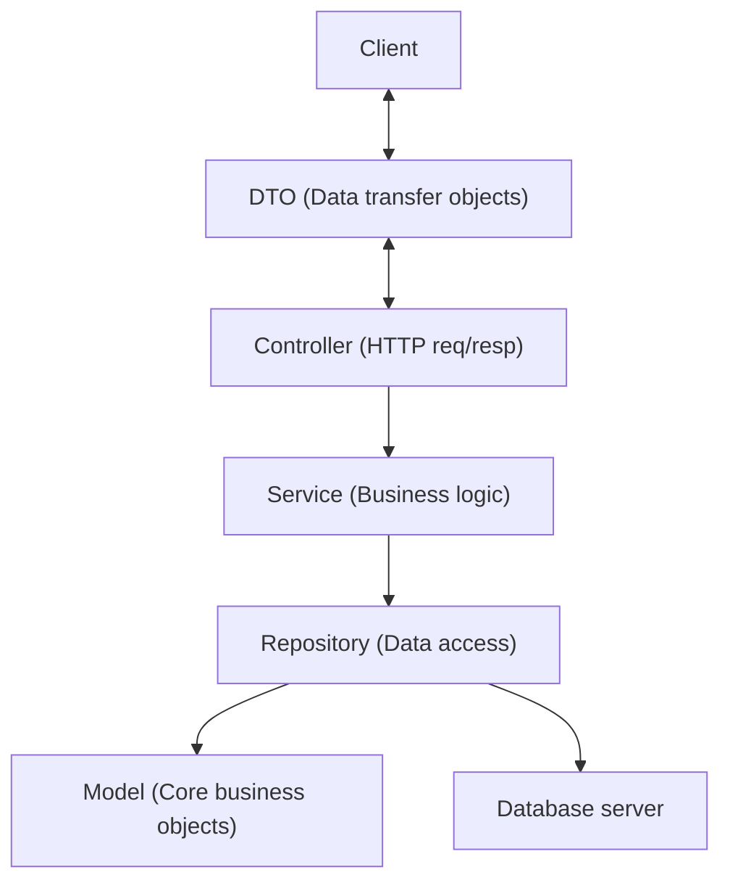

# Simple Messenger REST API

## Features

1. Register: a user can register with `username` (unique) and `password`
2. Login: a user can login with `username` and `password` and get a `jwt` authentification token
3. Send message: a user can send a single message to another user
4. Get recent messages: a user can get recent messages sent from another user:
   - Either by requesting the last `count` messages
   - Or by requesting recent received messaged since another message

## Run

- Run the database by: `docker compose up -d`
- Build and run the project by: `mvn spring-boot:run`

## Documentation

- http://localhost:8080/swagger-ui/index.html

## Architecture
---
MVC
---

