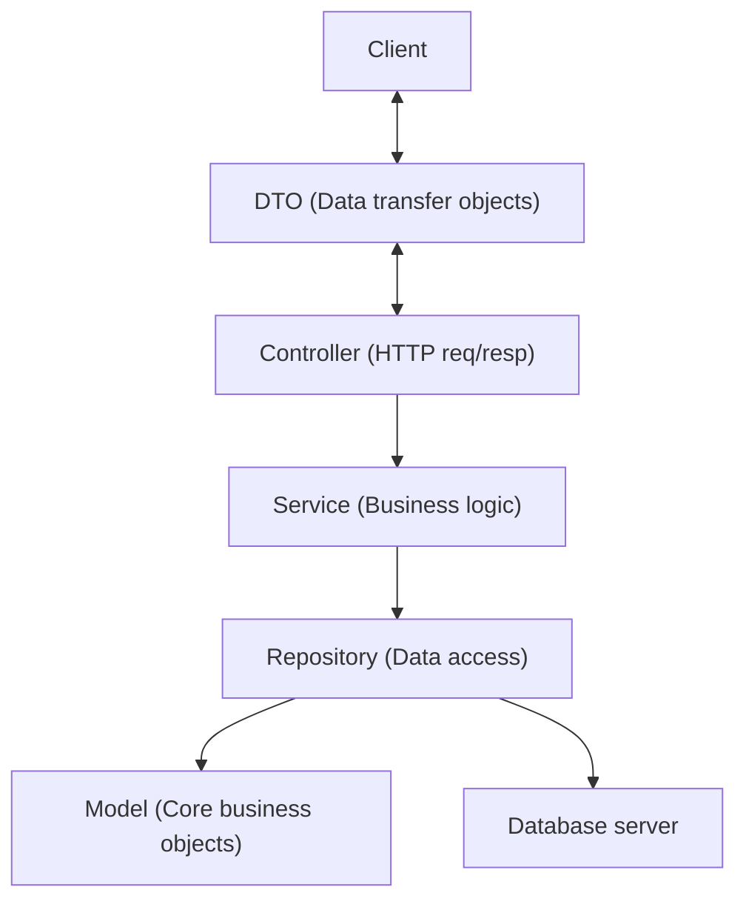

# Simple Messenger REST API

## Architecture

```mermaid
flowchart TD
  A["Client"] <--> F["DTO (Data transfer objects)"]
  F <--> B["Controller (HTTP req/resp)"]
  B --> C["Service (Business logic)"]
  C --> D["Repository (Data access)"]
  D --> E["Model (Core business objects)"]
  D --> DB["Database server"]
```
