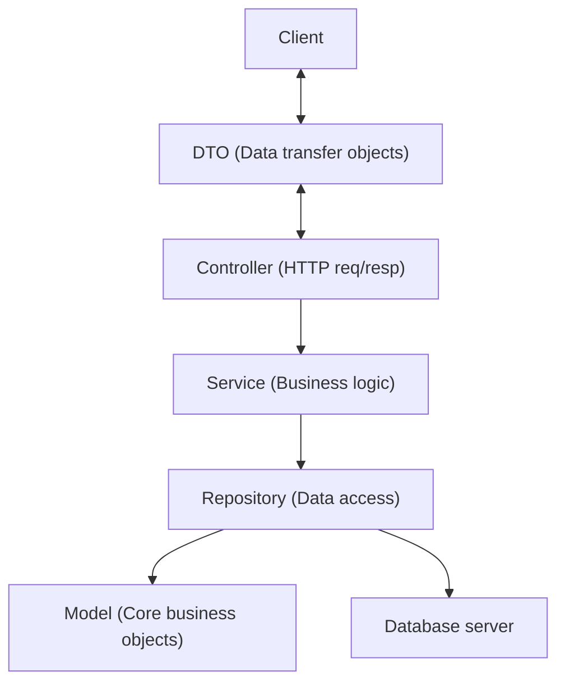

# Simple Messenger REST API

- https://github.com/edwinans/smessenger

## Features

1. Register: Users can create an account with a unique `username` and `password`.
2. Login: Users can authenticate with `username` and `password` and receive a JWT authentication token.
3. Send message: Authenticated users can send a single message to another user.
4. Retrieve recent messages: Get recent messages from a specific sender, with pagination:
  - Limit the number of returned messages
  - Fetch messages before a specified message

## Run

- Tested on: Ubuntu 24.04
- Required
  - Java 25 (JDK). Verify: `java -version`
  - Docker and docker-compose

- Quick start
  1. Start the database:
     ```sh
     docker compose up -d
     ```
     Verify: `docker compose ps`
  2. Build and run with the Maven Wrapper:
     ```sh
     ./mvnw spring-boot:run
     ```
     Or build a runnable jar:
     ```sh
     ./mvnw package
     java -jar target/smessenger.jar
     ```
  3. Stop the database:
     ```sh
     docker compose down
     ```

- Notes
  - If you prefer system Maven, replace `./mvnw` with `mvn`.
  - Application listens on port 8080 by default
  - Ensure the database container is healthy before starting the app (check `docker logs` or `docker compose ps`).

## Documentation

- http://localhost:8080/swagger-ui/index.html

## Architecture
---
MVC
---

