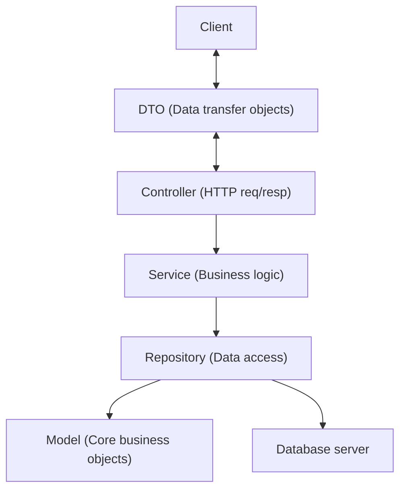

# Simple Messenger REST API

- https://github.com/edwinans/smessenger

## Features

1. Register: Users can create an account with a unique `username` and `password`.
2. Login: Users can authenticate with `username` and `password` and receive a JWT authentication token.
3. Send message: Authenticated users can send a single message to another user.
4. Retrieve recent messages: Get recent messages from a specific sender, with pagination:
  - Limit the number of returned messages
  - Fetch messages before a specified message

## Run

### System requirements

- Tested on: Ubuntu 24.04
- Required
  - Java 25 (JDK). Verify: `java -version`
  - Docker and docker-compose
- Optional
  - Makefile

### Quick start
  1. Start the PostgresSQL database:
     ```sh
     docker compose up -d
     ```
     Verify: `docker compose ps`
  2. Build and run with the Maven Wrapper:
     ```sh
     ./mvnw spring-boot:run
     ```
     Or build a runnable jar:
     ```sh
     ./mvnw package
     java -jar target/smessenger.jar
     ```
     *To build the package from scratch: `./mvnw clean install`*
  3. Stop the database:
     ```sh
     docker compose down
     ```

  Convenience: all of the above commands are also available via `make` (see [Makefile](./Makefile)). Common targets:

  - `make pg_up`: start PostgreSQL container
  - `make pg_down`: stop PostgreSQL container
  - `make run`: run app in `prod` profile
  - `make dev`: run app in `dev` profile
  - `make package` and `make run_jar`: produce and run `smessenger.jar`


### Run in dev mode (in-memory H2 database)

If you want to run the application using an in-memory H2 database for local development, start the app with the `dev` Spring profile. This will load `application-dev.properties` which configures H2.

```sh
./mvnw spring-boot:run -Dspring-boot.run.profiles=dev
```

#### H2 console

The H2 web console is enabled in the `dev` profile at:

http://localhost:8080/h2-console

- JDBC URL: `jdbc:h2:mem:testdb`
- Username: `sa`
- Password: (leave blank)

- Notes
  - If you prefer system Maven, replace `./mvnw` with `mvn`.
  - Application listens on port 8080 by default
  - Ensure the database container is healthy before starting the app (check `docker logs` or `docker compose ps`).

## Documentation

- http://localhost:8080/swagger-ui/index.html

## API Architecture
---
MVC
---

